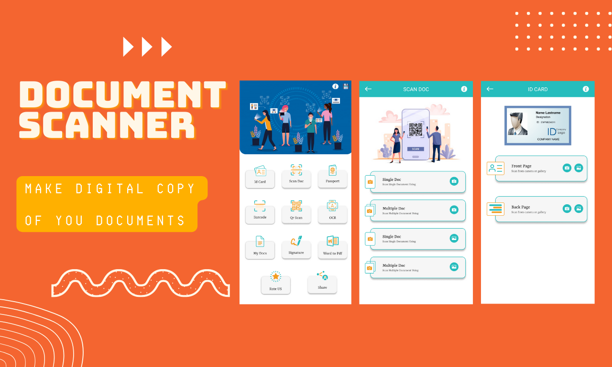

# CameraScanner

Camera Scanner App - PDF Scanner, Scan is an All-In-One Document Scanner App

## Screenshot

## Some feature listed over here:
<ul>
<li> Make ID card </li>
<li> Scan Documents </li>
<li> Passport </li>
<li> Barcode </li>
<li> QR Scanner </li>
<li> OCR Reader </li>
<li> Signature </li>
<li> Word to PDF </li>

</ul>

## Social Media

